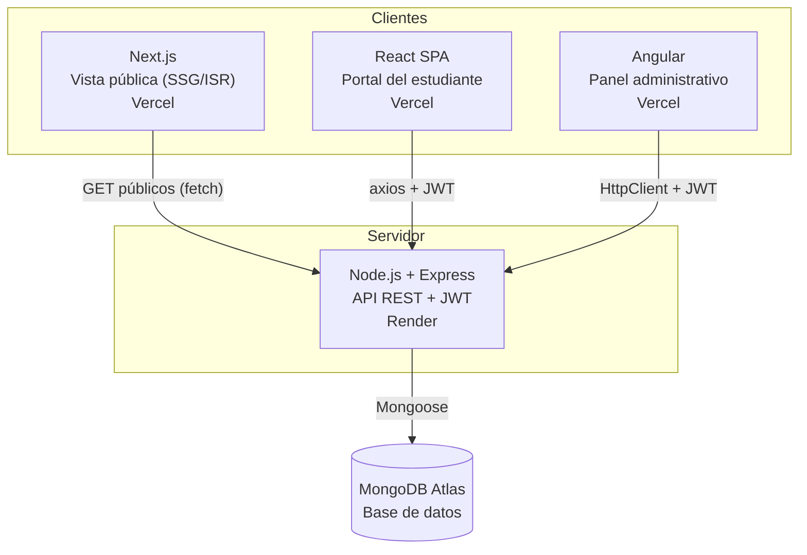
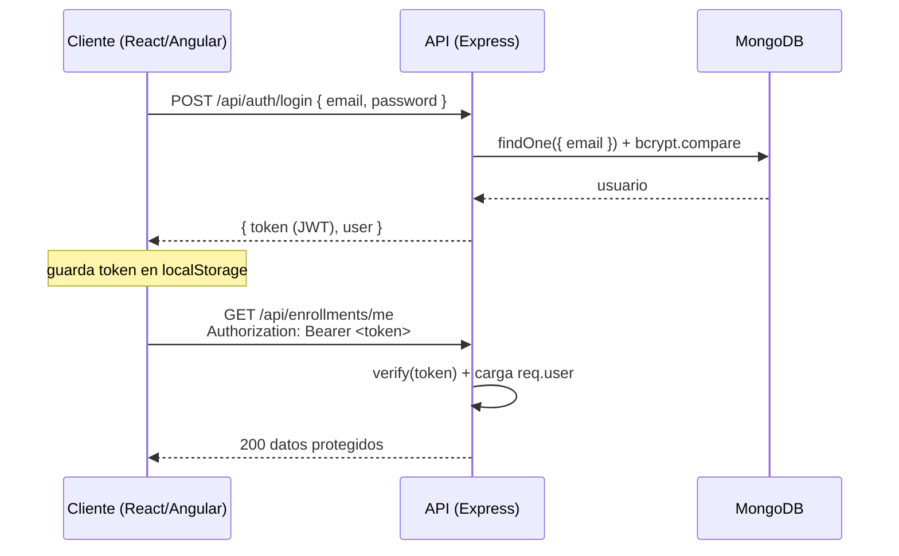

# Arquitectura de la solución

## Visión general

La plataforma sigue una arquitectura **cliente-servidor desacoplada**: un único backend
(API REST) sirve a tres frontends independientes, y una base de datos MongoDB persiste
todos los datos.



## Componentes

| Componente | Tecnología | Responsabilidad | Despliegue |
|---|---|---|---|
| **backend** | Node.js, Express, Mongoose | API REST, autenticación JWT, autorización por roles, reglas de negocio | Render |
| **public-next** | Next.js (App Router) | Catálogo público SEO-friendly con SSG + ISR | Vercel |
| **student-react** | React + Vite | Portal del estudiante (SPA): login, catálogo, inscripción, panel | Vercel |
| **admin-angular** | Angular 18 | Panel administrativo: CRUD de cursos y categorías | Vercel |
| **MongoDB** | MongoDB Atlas | Persistencia de usuarios, categorías, cursos e inscripciones | Atlas |

## Flujo de autenticación (JWT)



## Flujo de negocio de extremo a extremo

1. **Registro/Login** (React) → obtiene JWT.
2. **Consulta de cursos** (Next.js público o React) → `GET /api/courses`.
3. **Inscripción** (React, autenticado) → `POST /api/enrollments`.
4. **Visualización de inscripciones** (React) → `GET /api/enrollments/me`.
5. **Administración** (Angular, rol admin) → CRUD en `/api/courses` y `/api/categories`.
6. **Persistencia** → todo se guarda en MongoDB vía Mongoose.

## Estructura del backend (capas)

```
routes/        → definen endpoints y aplican middlewares (auth, rol, validación)
controllers/   → lógica de cada endpoint (orquestación)
models/        → esquemas Mongoose (User, Category, Course, Enrollment)
middlewares/   → auth JWT, autorización por rol, validación, manejo de errores
validators/    → reglas de express-validator por recurso
config/        → conexión a MongoDB
utils/         → seed de datos y smoke test
```
