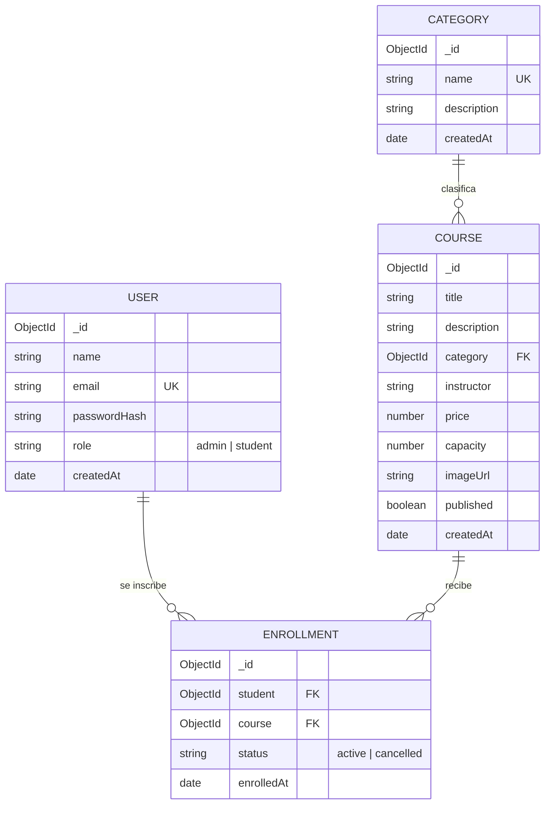

# Modelo de datos

## Diagrama entidad-relación

## Colecciones

### users
Usuarios del sistema. `passwordHash` se genera con **bcrypt** (nunca se guarda ni se
devuelve la contraseña en texto plano; el campo tiene `select: false`).

### categories
Clasificación de los cursos. `name` es único. **Segunda entidad** con CRUD administrativo.

### courses
Curso ofertado. Referencia a `category`. `published` controla su visibilidad en el catálogo
público. Índice de texto en `title` y `description` para búsqueda.

### enrollments
Inscripción de un estudiante en un curso. **Índice único compuesto `{ student, course }`**
que impide inscripciones duplicadas. El control de capacidad se valida contra `course.capacity`.

## Reglas de integridad

- No se puede eliminar una **categoría** con cursos asociados (409).
- Al eliminar un **curso** se eliminan en cascada sus inscripciones.
- Una **inscripción** duplicada activa devuelve 409; si estaba cancelada, se reactiva.
